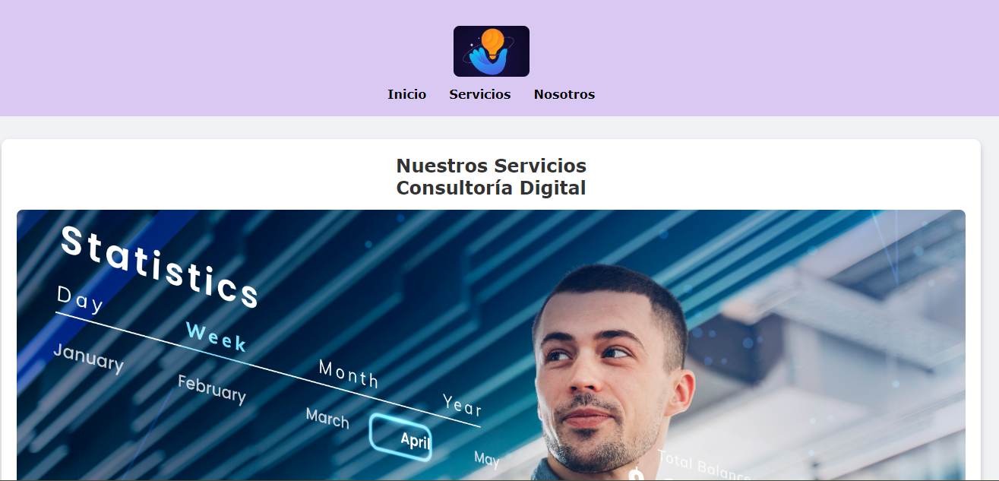
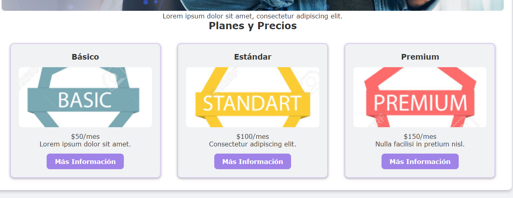

# Expansión de Sitio Web de Emprendimiento Digital

## Descripción 📋

Este proyecto tiene como objetivo expandir y mejorar el sitio web de un emprendimiento digital, permitiendo a los usuarios conocer los productos y servicios ofrecidos de manera más dinámica y atractiva. El sitio está construido con HTML y CSS, y está orientado a crear una experiencia fluida y visualmente atractiva para los usuarios interesados en mermeladas artesanales. La interfaz está diseñada para ser intuitiva, facilitando la navegación y la comprensión de la oferta de productos.

## Estructura de Carpetas y Archivos 📂
 *Emprendimiento-digital
 *css
 *img
 *page 

## Características Implementadas 🔧

* Página principal con información sobre los productos.
* Estilos CSS para una apariencia moderna y limpia.
* Adaptación responsive para dispositivos móviles.
* Inclusión de imágenes de productos para visualización directa.
* Integración de enlaces a redes sociales y contacto.

## Capturas de Pantalla 📸

## Autores ✒️

* **María Belén Anzules** - *Trabajo Inicial* - [belen_anzules](https://github.com/belen-anzules)

---

⌨️ con ❤️ por [Maria_Belen] 😊
